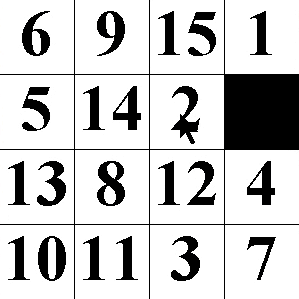
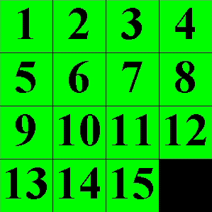

# Puzzle-15
A simple puzzle 15 game coded in Java. My record is 37 seconds. Not worth trying to beat it. LOL!

Below is a GIF showing you how to play. It's very simple.

* Run the program 
* Press 's' to shuffle the board
* Put them back in order

___

How about the code?
* *__GameManager.java__*: This class manages the thread, the drawing, the input and the updating.
* *__Puzzle15Board.java__*: This class contains the Puzzle 15 board and it's game logic.

If you wish to tweak the dimensions of the board. Go into the *__Puzzle15Board.java__* file and play with these 2:
```java
private final int kSIZE = 4; // size of the board
private final int TILE_SIZE = 75; // size of a tile in pixels
```
___

Result:



The shuffling is animated too!



